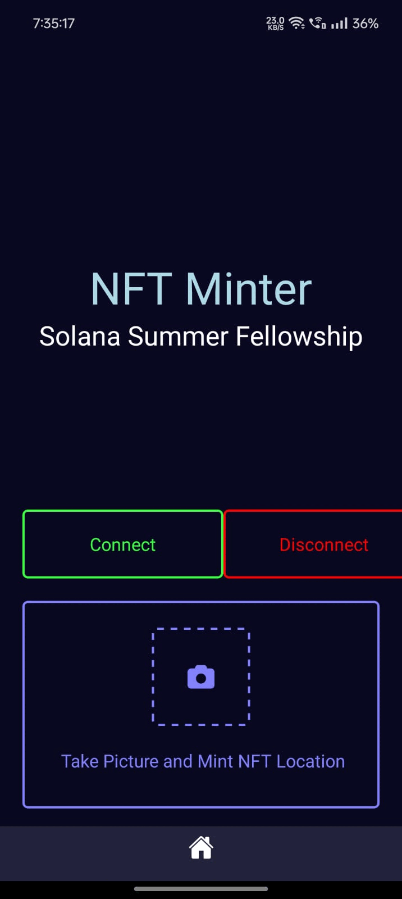

# Assignment 7: Camera-based NFT Minting App

<table>
  <tr>
    <td align="center" colspan="1">
      
    </td>
  </tr>
</table>

## Overview

Build an app that captures an image through the camera, mints an NFT with that image, and adds the current location longitude, latitude in the metadata.

## Tech Stack

- React Native: For building the mobile application
- Expo: For development and building
- Solana Web3.js: For interacting with the Solana blockchain
- Metaplex: For NFT creation and management
- Supabase: For storing images and metadata
- expo-camera: For capturing photos
- expo-location: For retrieving GPS coordinates

## Project Structure

## How to Use

1. Clone the repository
2. Install dependencies: `yarn install`
3. Set up your Expo account and environment
4. For local builds, set up React Native and Android environment following this [guide](https://docs.solanamobile.com/getting-started/development-setup)
5. Start the development server: `yarn start`

## Key Features

- Connect with Phantom wallet
- Capture photos and retrieve GPS location
- Create and mint NFTs with metadata including image and location information
- Upload images and metadata to Supabase
- Mint NFTs on Solana Devnet

## Notes

- This app is fully functional only on Android. iOS is not supported.
- Testing must be done on a physical Android device due to limitations with `expo-camera` on Android emulators for Expo v50.0.0 and below.

> [!WARNING]  
> NFTs are being minted directly without going through the Phantom wallet.
